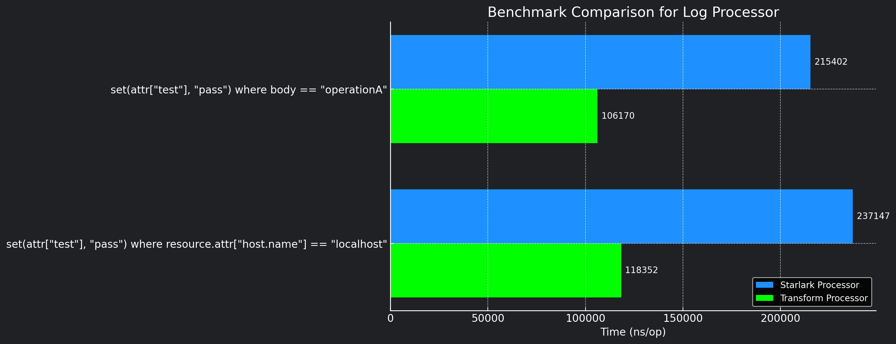

# starlark

<!-- status autogenerated section -->

| Status    |                                |
|-----------|--------------------------------|
| Stability | [alpha]: traces, metrics, logs |
<!-- end autogenerated section -->

The starlark processor modifies telemetry based on configuration using Starlark code.

Starlark is a scripting language used for configuration that is designed to be similar to Python. It is designed to be fast, deterministic, and easily embedded into other software projects.

The processor leverages Starlark to modify telemetry data while using familiar, pythonic syntax. Modifying telemetry data is as a simple as modifying a `Dict`.

## Why?

While there are a number of transform processors, most notably, the main OTTL [transform processor](https://github.com/open-telemetry/opentelemetry-collector-contrib/tree/main/processor/transformprocessor), this processor aims to grant users more flexibility by allowing them to manipulate telemetry data using a familiar syntax.

Python is a popular, well known language, even among non-developers. By allowing Starlark code to be used as an option to transform telemetry data, users can leverage their existing knowledge of Python to transform or manipulate their telemetry data.

## Config

| Parameter  | Desc                                                                        |
|------------|-----------------------------------------------------------------------------|
| entrypoint | The name of the function to call when executing the starlark script         |
| code       | Add in-line starlark code directly to your config                           |
| script     | Allows you to set the script source. Supports **File path** or **HTTP URL** |

To configure starlark, you can add your code using the `code` option in the config and specify the name of the function to call using the `entrypoint` option.

```yaml
processors:
  starlark:
	entrypoint: transform
    code: |
      def transform(event):
        event = json.decode(event)
        <your starlark code>
        return event
```

Alternatively, in cases where you prefer to not have starlark code present or visible in your Open Telemetry configuration, you can use the `script` parameter to pass your script from a file or http url.

```yaml
processors:
  starlark:
	entrypoint: transform
	script: /path/to/script.star

# or
processors:
  starlark:
	entrypoint: transform
	script: https://some.url.com/script.star

```

Your `entrypoint` must define a function that accepts a single argument, the name of the argument **does not** have to be `event` like the examples above. This function is called by the processor and is passed the telemetry event. The function **must return** the modified telemetry event.

## How it works

The processor uses the [Starlark-Go](https://github.com/google/starlark-go) interpreter, this allows you to run this processor without having to install a Starlark language interpreter on the host.

## Features

The starlark processor gives you access to the full telemetry event payload. You are able to modify this payload using the Starklark code in any way you want. This allows you do various things such as:

- Filtering
- Adding/Removing attributes
- Modifying attributes
- Modifying telemetry data directly
- Telemetry injection based on existing values
- Live, detailed, telemetry data debugging and evaluation
- And much more

## Modules, Functions and Functionality

While similar in syntax to Python, Starlack does not have all the functionality associated with Python. This processor does not have access to Python standard libraries and the implementation found in this processor is limited further to only the following libraries and functions:

- **json**

The JSON library allows you to encode and decode JSON strings. The use of this library is mandatory as the telemetry data is passed to the processor as a JSON string. You must decode the JSON string to a Dict before you can modify it. **You must also return a JSON decoded Dict to the processor.**

```python
# encode dict string to json string
x = json.encode({"foo": ["bar", "baz"]})
print(x)
# output: {"foo":["bar","baz"]}
```

```python
# decode json string to dict
x = json.decode('{"foo": ["bar", "baz"]}')
```

You can read more on the JSON library [here](https://qri.io/docs/reference/starlark-packages/encoding/json)

- **log** modules and **print** function

You are able to use the print function or log module to print output to the Open Telemetry runtime log. This is useful for debugging your Starlark code as well as general logging based on evaluation of the telemetry data. For example, you may want to print a log message if certain values or behaviors are identified in the telemetry data.

```python
def transform(event):
	print("hello world")
	return json.decode(event)
```

The print statement above would result in the following output in the Open Telemetry runtime log when opentelemetry is run in debug mode:

```log
2023-09-23T16:50:17.328+0200	debug	traces/processor.go:25	hello world	{"kind": "processor", "name": "starlark/traces", "pipeline": "traces", "thread": "trace.processor", "source": "starlark/code"}
```

If you want to log messages outside of the debug mode, you can use the log module:

```python
def transform(event):
	log.info("hello world")
	return json.decode(event)
```

There are 3 log levels available: - `log.info` - `log.warn` - `log.error`

Again, note that the debug level is handled by the `print` function and is only available in debug mode.

- **re** (regex)

> Support for Regular Expressions coming soon

Note that you can define your own functions within your Starlark code, and call them as required, however, there must be at least one entrypoint function that accepts a single argument telemetry event argument and returns the modified event.

## Examples

This section contains examples of the event payloads that are sent to the starlark processor from each telemetry type. These examples can help you understand the structure of the telemetry events and how to modify them.

##### Log Event Payload Example:

```json
{
	"resourceLogs": [{
		"resource": {
			"attributes": [{
				"key": "log.file.name",
				"value": {
					"stringValue": "test.log"
				}
			}]
		},
		"scopeLogs": [{
			"scope": {},
			"logRecords": [{
				"observedTimeUnixNano": "1694127596456358000",
				"body": {
					"stringValue": "2023-09-06T01:09:24.045+0200 INFO starting app.",
					"attributes": [{

						"key": "app",
						"value": {
							"stringValue": "dev"
						}
					}],
					"traceId": "",
					"spanId": ""
				}
			}]
		}]
	}]
}
```

View the the log.proto type definition [here](https://github.com/open-telemetry/opentelemetry-proto/blob/main/opentelemetry/proto/logs/v1/logs.proto)

##### Metric Event Payload Example:

```json
{
	"resourceMetrics": [{
		"resource": {},
		"scopeMetrics": [{
			"scope": {
				"name": "otelcol/hostmetricsreceiver/memory",
				"version": "0.84.0"
			},
			"metrics": [{
				"name": "system.memory.usage",
				"description": "Bytes of memory in use.",
				"unit": "By",
				"sum": {
					"dataPoints": [{
							"attributes": [{
								"key": "state",
								"value": {
									"stringValue": "used"
								}
							}],
							"startTimeUnixNano": "1694171569000000000",
							"timeUnixNano": "1694189699786689531",
							"asInt": "1874247680"
						},
						{
							"attributes": [{
								"key": "state",
								"value": {
									"stringValue": "free"
								}
							}],
							"startTimeUnixNano": "1694171569000000000",
							"timeUnixNano": "1694189699786689531",
							"asInt": "29214199808"
						}
					],
					"aggregationTemporality": 2
				}
			}]
		}],
		"schemaUrl": "https://opentelemetry.io/schemas/1.9.0"
	}]
} 
```

View the metric.proto type definition [here](https://github.com/open-telemetry/opentelemetry-proto/blob/main/opentelemetry/proto/metrics/v1/metrics.proto)

##### Trace Event Payload Example:

```json
{
	"resourceSpans": [{
		"resource": {
			"attributes": [{
					"key": "telemetry.sdk.language",
					"value": {
						"stringValue": "python"
					}
				},
				{
					"key": "telemetry.sdk.name",
					"value": {
						"stringValue": "opentelemetry"
					}
				},
				{
					"key": "telemetry.sdk.version",
					"value": {
						"stringValue": "1.19.0"
					}
				},
				{
					"key": "telemetry.auto.version",
					"value": {
						"stringValue": "0.40b0"
					}
				},
				{
					"key": "service.name",
					"value": {
						"stringValue": "unknown_service"
					}
				}
			]
		},
		"scopeSpans": [{
			"scope": {
				"name": "opentelemetry.instrumentation.flask",
				"version": "0.40b0"
			},
			"spans": [{
				"traceId": "9cb5bf738137b2248dc7b20445ec2e1c",
				"spanId": "88079ad5c94b5b13",
				"parentSpanId": "",
				"name": "/roll",
				"kind": 2,
				"startTimeUnixNano": "1694388218052842000",
				"endTimeUnixNano": "1694388218053415000",
				"attributes": [{
						"key": "http.method",
						"value": {
							"stringValue": "GET"
						}
					},
					{
						"key": "http.server_name",
						"value": {
							"stringValue": "0.0.0.0"
						}
					},
					{
						"key": "http.scheme",
						"value": {
							"stringValue": "http"
						}
					},
					{
						"key": "net.host.port",
						"value": {
							"intValue": "5001"
						}
					},
					{
						"key": "http.host",
						"value": {
							"stringValue": "localhost:5001"
						}
					},
					{
						"key": "http.target",
						"value": {
							"stringValue": "/roll"
						}
					},
					{
						"key": "net.peer.ip",
						"value": {
							"stringValue": "127.0.0.1"
						}
					},
					{
						"key": "http.user_agent",
						"value": {
							"stringValue": "curl/7.87.0"
						}
					},
					{
						"key": "net.peer.port",
						"value": {
							"intValue": "52365"
						}
					},
					{
						"key": "http.flavor",
						"value": {
							"stringValue": "1.1"
						}
					},
					{
						"key": "http.route",
						"value": {
							"stringValue": "/roll"
						}
					},
					{
						"key": "http.status_code",
						"value": {
							"intValue": "200"
						}
					}
				],
				"status": {}
			}]
		}]
	}]
}
```

View the trace.proto type definition [here](https://github.com/open-telemetry/opentelemetry-proto/blob/main/opentelemetry/proto/trace/v1/trace.proto).

## Full Configuration Example

For following configuration example demonstrates the starlark processor telemetry events for logs, metrics and traces.

```yaml
receivers:
  otlp:
    protocols:
      http:
        endpoint: "0.0.0.0:4318"
      grpc:
        endpoint: "0.0.0.0:4317"

  filelog:
    start_at: beginning
    include_file_name: true
    include: 
      - $LOGFILE

    operators:
      - type: move
        from: attributes["log.file.name"]
        to: resource["log.file.name"]

      - type: add
        field: attributes.app
        value: dev

processors:

  # - change resource attribute log.file.name to source.log
  # - add resource attribute cluster: dev
  # - filter out any logs that contain the word password
  # - add an attribute to each log: language: golang
  starlark/logs:
    code: |
      def transform(event):
        # edit resource attributes
        for data in event['resourceLogs']:
          for attr in data['resource']['attributes']:
            attr['value']['stringValue'] = 'source.log'

        # filter/delete logs
        for data in event['resourceLogs']:
          for slog in  data['scopeLogs']:
            slog['logRecords'] = [ lr for lr in slog['logRecords'] if 'internal' not in lr['body']['stringValue']]
            
            # add an attribute to each log
            for lr in slog['logRecords']:
              lr['attributes'].append({
                'key': 'language',
                'value': {
                  'stringValue': 'golang'
                }})
                
        return event
  # - print event received to otel runtime log
  # - if there are no resources, add a resource attribute source starlark
  # - prefix each metric name with starlark
  starlark/metrics:
    code: |
      def transform(event):
        print("received event", event)
        for md in event['resourceMetrics']:
          # if resources are empty
          if not md['resource']:
            md['resource'] = {
              'attributes': [
                {
                  "key": "source",
                  "value": {
                    "stringValue": "starlark"
                  }
                }
              ]
            }

          # prefix each metric name with starlark
          for sm in md['scopeMetrics']:
            for m in sm['metrics']:
              m['name'] = 'starlark.' + m['name']

        return event

  # - add resource attribute source starlark
  # - filter out any spans with http.target /roll attribute
  starlark/traces:
    code: |
      def transform(event):
        for td in event['resourceSpans']:
          # add resource attribute
          td['resource']['attributes'].append({
            'key': 'source',
            'value': {
              'stringValue': 'starlark'
            }
          })

          # filter spans with http.target /roll attribute
          has_roll = lambda attrs: [a for a in attrs if a['key'] == 'http.target' and a['value']['stringValue'] == '/cats']
          for sd in td['scopeSpans']:
            sd['spans'] = [
              s for s in sd['spans']
              if not has_roll(s['attributes'])
            ]
        return event
exporters:
  logging:
    verbosity: detailed


service:
  pipelines:
    logs:
      receivers:
      - filelog
      processors:
      - starlark/logs
      exporters:
      - logging

    metrics:
      receivers:
      - otlp
      processors:
      - starlark/metrics
      exporters:
      - logging

    traces:
      receivers:
      - otlp
      processors:
      - starlark/traces
      exporters:
      - logging
```

### Performance

The graph below shows a comparison of the starklark processor vs the transform processor. While the starlark processor is far from slow, the transform processor is twice as fast overall when performing the same type of transformation. If speed is a concern, you may want to consider using the transform processor instead.

<p align="center">
  
</p>

The starklark processor is a great component for highly complex or specialised types of transformations that simply can't be performed using the transform processor.

### Warnings

The starlark processor allows you to modify all aspects of your telemetry data. This can result in invalid or bad data being propogated if you are not careful. It is your responsibility to inspect the data and ensure it is valid.
