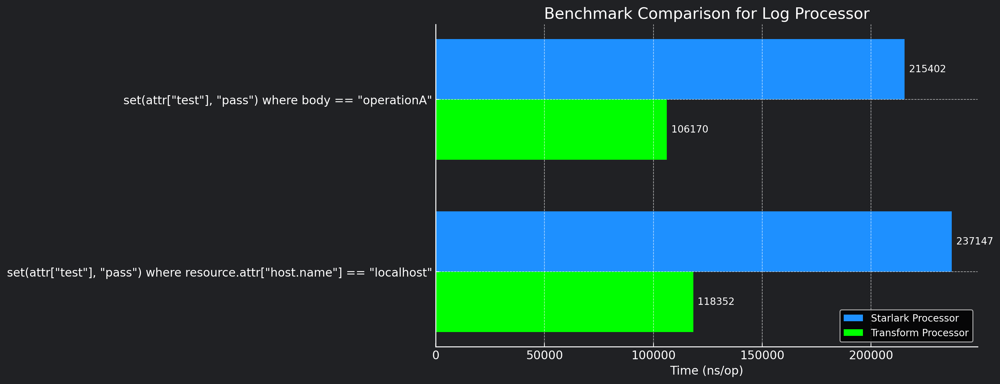

# starlark

<!-- status autogenerated section -->

| Status    |                                |
|-----------|--------------------------------|
| Stability | [alpha]: traces, metrics, logs |
<!-- end autogenerated section -->

The starlark processor modifies telemetry based on configuration using Starlark code.

Starlark is a scripting language used for configuration that is designed to be similar to Python. It is designed to be fast, deterministic, and easily embedded into other software projects.

The processor leverages Starlark to modify telemetry data while using familiar, pythonic syntax. Modifying telemetry data is as a simple as modifying a `Dict`.

## Why?

While there are a number of transform processors, most notably, the main OTTL [transform processor](https://github.com/open-telemetry/opentelemetry-collector-contrib/tree/main/processor/transformprocessor), this processor aims to grant users more flexibility by allowing them to manipulate telemetry data using a familiar syntax.

Python is a popular, well known language, even among non-developers. By allowing Starlark code to be used as an option to transform telemetry data, users can leverage their existing knowledge of Python to transform or manipulate their telemetry data.

## Config

| Parameter  | Desc                                                                        |
|------------|-----------------------------------------------------------------------------|
| entrypoint | The name of the function to call when executing the starlark script         |
| code       | Add in-line starlark code directly to your config                           |
| script     | Allows you to set the script source. Supports **File path** or **HTTP URL** |

To configure starlark, you can add your code using the `code` option in the config and specify the name of the function to call using the `entrypoint` option.

```yaml
processors:
  starlark:
    entrypoint: transform
    code: |
      def transform(event):
        <your starlark code>
        return event
```

Alternatively, in cases where you prefer to not have starlark code present or visible in your Open Telemetry configuration, you can use the `script` parameter to pass your script from a file or http url.

```yaml
processors:
  starlark:
    entrypoint: transform
    script: /path/to/script.star

# or
processors:
  starlark:
    entrypoint: transform
    script: https://some.url.com/script.star

```

Your `entrypoint` must define a function that accepts a single argument, the name of the argument **does not** have to be `event` like the examples above. This function is called by the processor and is passed the telemetry event. The function **must return** the modified telemetry event.

## How it works

The processor uses the [Starlark-Go](https://github.com/google/starlark-go) interpreter, this allows you to run this processor without having to install a Starlark language interpreter on the host.

## Features

The starlark processor gives you access to the full telemetry event payload. You are able to modify this payload using the Starklark code in any way you want. This allows you do various things such as:

- Filtering
- Adding/Removing attributes
- Modifying attributes
- Modifying telemetry data directly
- Telemetry injection based on existing values
- Live, detailed, telemetry data debugging and evaluation
- And much more

## Modules & Functions

While similar in syntax to Python, Starlack does not have all the functionality associated with Python. This processor does not have access to Python standard libraries and the implementation found in this processor is limited further to only the following libraries and functions:

- [emit](#emit)
- [json](#json)
- [log & print](#log-modules-and-print-function)
- [re (regex) - *coming soon*](#re-regex)

#### emit

The `emit` function is used to emit the telemetry event to the next processor in the pipeline.

`emit(object: TelemetryObject)`

*Example:* Given the log event below, say we need to split this event into 2 separate logs by parsing the `stringValue` of the body, which contains a JSON string containing multiple log lines.

```json
{
	"resourceLogs": [{
		"resource": {
			"attributes": [{
				"key": "log.file.name",
				"value": {
					"stringValue": "test.log"
				}
			}]
		},
		"scopeLogs": [{
			"scope": {},
			"logRecords": [{
				"observedTimeUnixNano": "1694127596456358000",
				"body": {
					"stringValue": "{\"logs\": [\"log line one\", \"log line two\"]}",
					"attributes": [{

						"key": "app",
						"value": {
							"stringValue": "dev"
						}
					}],
					"traceId": "",
					"spanId": ""
				}
			}]
		}]
	}]
}
```

*Split the log event into multiple log events:*

```python
def transform(event):
	# get log body
	for rlog in event['resourceLogs']:
		for slogs in rlog['scopeLogs']:
			for lr in slogs['logRecords']:
				body = lr['body']['stringValue']
				# split the body using json decode
				decoded = json.decode(body)
				for line in decoded['logs']:
					lr['body']['stringValue'] = line # set body value to log line
					emit(event) # emit modified event

	# return nothing since we've emited the log in parts already
	return None
```

**Importanat:** emited events must fit the opentelemetry proto type definition for the telemetry type. That is, the events must be valid for the next processor in the pipeline.

#### json

The `json` *module* allows you to encode and decode JSON strings. Telemetry events are encoded to JSON by default when being passed to your starlark entrypoint, however, this module is useful for further manipulating nested JSON strings inside your telemetry data.

The json module has 2 funcitons:

`encode(json: object) --> string` - encodes JSON objects to strings.

```python
# encode dict string to json string
x = json.encode({"foo": ["bar", "baz"]})
log.info(x)
# output: {"foo":["bar","baz"]}
```

`decode(json: string) --> dict` - decodes JSON string to dict.

```python
# decode json string to dict
x = json.decode('{"foo": ["bar", "baz"]}')
log.info(x["foo"])
# output: ["bar", "baz"]
```

You can read more on the JSON module [here](https://qri.io/docs/reference/starlark-packages/encoding/json)

#### log modules and **print** function

You are able to use the `print` function or `log` module to print output to the Open Telemetry runtime log. This is useful for debugging your Starlark code as well as general logging based on evaluation of the telemetry data. For example, you may want to print a log message if certain values or behaviors are identified in the telemetry data.

```python
def transform(event):
    print("hello world")
    return event
```

The print statement above would result in the following output in the Open Telemetry runtime log when opentelemetry is run in debug mode:

```log
2023-09-23T16:50:17.328+0200	debug	traces/processor.go:25	hello world	{"kind": "processor", "name": "starlark/traces", "pipeline": "traces", "thread": "trace.processor", "source": "starlark/code"}
```

If you want to log messages outside of the debug mode, you can use the log module:

```python
def transform(event):
    log.info("hello world")
    return event
```

There are 3 log levels available: - `log.info` - `log.warn` - `log.error`

Again, note that the debug level is handled by the `print` function and is only available in debug mode.

#### re (regex)

> Support for Regular Expressions coming soon

Note that you can define your own functions within your Starlark code, and call them as required, however, there must be at least one entrypoint function that accepts a single argument telemetry event argument and returns the modified event.

## OTLP Types

The Starlark processor provides direct access to and manipulation of OpenTelemetry Protocol (OTLP) data structures within your Starlark scripts. This allows for fine-grained control over telemetry data. You can interact with Logs, Metrics, and Traces using dedicated Starlark types that mirror the OTLP structure.

These types provide methods to access and modify their respective fields and attributes, offering a powerful way to enrich, filter, or transform your telemetry data.

### Logs

The `otlp.log()` function provides access to log data. You pass the raw log event (which is a Starlark `dict`) to this function to get an `OTLPLog` object.

**Types:**

*   **`OTLPLog`**: Represents the top-level log structure.
    *   **Attributes**:
        *   `resourceLogs`: A list of `ResourceLogs` objects. Access as `log_event.resourceLogs`.
    *   **Methods**: This object itself is based on a Starlark `dict`, so standard dictionary methods can be used.

*   **`ResourceLogs`**: Represents logs from a specific resource.
    *   **Attributes**:
        *   `resource`: An `otlp.Resource` object representing the source of the logs. Access as `rlog.resource`.
        *   `scopeLogs`: A list of `ScopeLogs` objects. Access as `rlog.scopeLogs`.
    *   **Methods**: This object itself is based on a Starlark `dict`, so standard dictionary methods can be used.

*   **`otlp.Resource`**: Represents a resource.
    *   **Attributes**:
        *   `attributes`: A list of `Attribute` objects. Access as `res.attributes`.
    *   **Methods**: This object itself is based on a Starlark `dict`, so standard dictionary methods can be used.

*   **`ScopeLogs`**: Represents logs from a specific scope (e.g., an instrumentation library).
    *   **Attributes**:
        *   `scope`: A Starlark `dict` representing the scope. Access as `slog.scope`.
        *   `logRecords`: A list of `LogRecord` objects. Access as `slog.logRecords`.
    *   **Methods**: This object itself is based on a Starlark `dict`, so standard dictionary methods can be used.

*   **`LogRecord`**: Represents an individual log entry.
    *   **Attributes**:
        *   `observedTimeUnixNano`: (String) The time the log was observed. Access as `lr.observedTimeUnixNano`.
        *   `body`: (Any) The body of the log record. Access as `lr.body`.
        *   `attributes`: A list of `Attribute` objects. Access as `lr.attributes`.
        *   `traceId`: (String) The Trace ID associated with the log. Access as `lr.traceId`.
        *   `spanId`: (String) The Span ID associated with the log. Access as `lr.spanId`.
    *   **Methods**: This object itself is based on a Starlark `dict`, so standard dictionary methods can be used.

*   **`Attribute`**: Represents a key-value pair. This is a list-like object in Starlark, where each item in the list is a `dict` with "key" and "value". The `value` itself is a `dict` indicating the type (e.g. `{"stringValue": "example"}`).
    *   **Methods**:
        *   `get(key_string)`: Retrieves the value of an attribute by its key. Returns `None` if not found.
            *Example*: `attrs.get("http.method")`
        *   `set(key_string, value, type_string="stringValue")`: Sets the value of an attribute. If the key exists, it's updated. If not, a new attribute is added. The `type_string` argument is optional and defaults to `"stringValue"`. Other possible types are `"boolValue"`, `"doubleValue"`, `"intValue"`.
            *Example*: `attrs.set("new_attr", "new_value")`
            *Example*: `attrs.set("count", 10, type_string="intValue")`

**List Operations:**

Lists of `ResourceLogs`, `ScopeLogs`, `LogRecord`, and `Attribute` support the following methods:

*   `filter(lambda)`: Returns a new list containing only items for which the lambda function returns `True`.
    *Example*: `event.resourceLogs.filter(lambda rlog: len(rlog.scopeLogs) > 0)`
*   `apply(lambda)`: Calls the lambda function for each item in the list. The original list is modified in place if the lambda modifies the items.
    *Example*: `slog.logRecords.apply(lambda lr: lr.attributes.set("processed", True, type_string="boolValue"))`
*   `range(lambda)`: Returns a new list by applying the lambda function to each item in the original list. This is similar to Python's `map` function.
    *Example*: `lr.attributes.range(lambda attr: attr.get("key"))`

**Example:**

```python
def transform(event_dict):
    log_event = otlp.log(event_dict) # Convert raw dict to OTLPLog object

    for rlog in log_event.resourceLogs:
        rlog.resource.attributes.set("custom_resource_attr", "added_by_starlark")
        for slog in rlog.scopeLogs:
            # Filter out log records that don't have a body
            slog.logRecords = slog.logRecords.filter(lambda lr: lr.body != None)
            for lr in slog.logRecords:
                lr.attributes.set("log_processed", True, "boolValue")
                if lr.attributes.get("app") == "my_app":
                    lr.body = "Processed: " + lr.body.stringValue # Assuming body is stringValue
    return event_dict # Return the modified dict
```

### Metrics

**Note:** The Starlark OTLP Metrics types are designed to mirror common OTLP metric structures. The exact fields and methods might vary based on the specific implementation. It's assumed that an `otlp.metric()` function exists, similar to `otlp.log()`, for converting a raw metric event dictionary into an `OTLPMetric` object.

The `otlp.metric()` function (assumed) provides access to metric data. You would pass the raw metric event (a Starlark `dict`) to this function to get an `OTLPMetric` object.

**Assumed Types:**

*   **`OTLPMetric`**: Represents the top-level metric structure.
    *   **Attributes**:
        *   `resourceMetrics`: A list of `ResourceMetrics` objects.
    *   **Methods**: Based on Starlark `dict`.

*   **`ResourceMetrics`**: Represents metrics from a specific resource.
    *   **Attributes**:
        *   `resource`: An `otlp.Resource` object.
        *   `scopeMetrics`: A list of `ScopeMetrics` objects.
    *   **Methods**: Based on Starlark `dict`.

*   **`otlp.Resource`**: (Shared with Logs) Represents a resource.
    *   **Attributes**:
        *   `attributes`: A list of `Attribute` objects.
    *   **Methods**: Based on Starlark `dict`. (See Logs section for `Attribute` methods `get` and `set`)

*   **`ScopeMetrics`**: Represents metrics from a specific scope.
    *   **Attributes**:
        *   `scope`: A Starlark `dict` representing the scope.
        *   `metrics`: A list of `Metric` objects.
    *   **Methods**: Based on Starlark `dict`.

*   **`Metric`**: Represents an individual metric. This can be a Sum, Gauge, Histogram, etc. The exact fields will depend on the metric type.
    *   **Common Attributes**:
        *   `name`: (String) The name of the metric.
        *   `description`: (String) The description of the metric.
        *   `unit`: (String) The unit of the metric.
        *   `sum`, `gauge`, `histogram`, `summary`: (Object) One of these will be present depending on the metric type, containing the data points.
    *   **Methods**: Based on Starlark `dict`.

*   **`DataPoint` (within Sum, Gauge, etc.)**: Represents a single data point.
    *   **Common Attributes**:
        *   `attributes`: A list of `Attribute` objects.
        *   `startTimeUnixNano`: (String) The start time of the metric.
        *   `timeUnixNano`: (String) The time the metric was recorded.
        *   `asInt`, `asDouble`: (String/Int/Float) The value of the data point.
    *   **Methods**: Based on Starlark `dict`.

*   **`Attribute`**: (Shared with Logs) Represents a key-value pair.
    *   **Methods**: `get(key_string)`, `set(key_string, value, type_string="stringValue")`. (See Logs section for details).

**List Operations:**

Lists of `ResourceMetrics`, `ScopeMetrics`, `Metric`, `DataPoint`, and `Attribute` are assumed to support the same `filter`, `apply`, and `range` methods as described in the Logs section.

**Example (Conceptual):**

```python
def transform(event_dict):
    # Assuming otlp.metric() function exists
    metric_event = otlp.metric(event_dict) 

    for rmetric in metric_event.resourceMetrics:
        rmetric.resource.attributes.set("metric_source", "starlark_processor")
        for smetric in rmetric.scopeMetrics:
            for m in smetric.metrics:
                if m.name == "system.cpu.time":
                    m.name = "starlark.system.cpu.time" # Rename metric
                    # Iterate over data points (structure depends on metric type)
                    if hasattr(m, "sum") and m.sum != None:
                        for dp in m.sum.dataPoints: # Assuming dataPoints is a list
                            dp.attributes.set("processed_by_starlark", True, "boolValue")
    return event_dict
```

### Traces

**Note:** The Starlark OTLP Traces types are designed to mirror common OTLP trace structures. The exact fields and methods might vary based on the specific implementation. It's assumed that an `otlp.trace()` function exists, similar to `otlp.log()`, for converting a raw trace event dictionary into an `OTLPTrace` object.

The `otlp.trace()` function (assumed) provides access to trace data. You would pass the raw trace event (a Starlark `dict`) to this function to get an `OTLPTrace` object.

**Assumed Types:**

*   **`OTLPTrace`**: Represents the top-level trace structure.
    *   **Attributes**:
        *   `resourceSpans`: A list of `ResourceSpans` objects.
    *   **Methods**: Based on Starlark `dict`.

*   **`ResourceSpans`**: Represents spans from a specific resource.
    *   **Attributes**:
        *   `resource`: An `otlp.Resource` object.
        *   `scopeSpans`: A list of `ScopeSpans` objects.
    *   **Methods**: Based on Starlark `dict`.

*   **`otlp.Resource`**: (Shared with Logs) Represents a resource.
    *   **Attributes**:
        *   `attributes`: A list of `Attribute` objects.
    *   **Methods**: Based on Starlark `dict`. (See Logs section for `Attribute` methods `get` and `set`)

*   **`ScopeSpans`**: Represents spans from a specific scope.
    *   **Attributes**:
        *   `scope`: A Starlark `dict` representing the scope.
        *   `spans`: A list of `Span` objects.
    *   **Methods**: Based on Starlark `dict`.

*   **`Span`**: Represents an individual span.
    *   **Common Attributes**:
        *   `traceId`: (String) The Trace ID.
        *   `spanId`: (String) The Span ID.
        *   `parentSpanId`: (String) The Parent Span ID.
        *   `name`: (String) The name of the span.
        *   `kind`: (Integer) The kind of span (e.g., client, server).
        *   `startTimeUnixNano`: (String) The start time of the span.
        *   `endTimeUnixNano`: (String) The end time of the span.
        *   `attributes`: A list of `Attribute` objects.
        *   `status`: (Object) An object indicating the status of the span (e.g., `{"code": 0}`).
    *   **Methods**: Based on Starlark `dict`.

*   **`Attribute`**: (Shared with Logs) Represents a key-value pair.
    *   **Methods**: `get(key_string)`, `set(key_string, value, type_string="stringValue")`. (See Logs section for details).

**List Operations:**

Lists of `ResourceSpans`, `ScopeSpans`, `Span`, and `Attribute` are assumed to support the same `filter`, `apply`, and `range` methods as described in the Logs section.

**Example (Conceptual):**

```python
def transform(event_dict):
    # Assuming otlp.trace() function exists
    trace_event = otlp.trace(event_dict)

    for rspan in trace_event.resourceSpans:
        rspan.resource.attributes.set("trace_transformed_by", "starlark")
        for sspan in rspan.scopeSpans:
            # Filter out spans that are not server spans (kind = 2)
            sspan.spans = sspan.spans.filter(lambda sp: sp.kind == 2) # Assuming kind is an attribute
            for span in sspan.spans:
                if span.attributes.get("http.target") == "/old/path":
                    span.attributes.set("http.target", "/new/path")
                span.name = "StarlarkProcessed-" + span.name
    return event_dict
```

## Examples

This section contains examples of the event payloads that are sent to the starlark processor from each telemetry type. These examples can help you understand the structure of the telemetry events and how to modify them.

##### Log Event Payload Example:

```json
{
	"resourceLogs": [{
		"resource": {
			"attributes": [{
				"key": "log.file.name",
				"value": {
					"stringValue": "test.log"
				}
			}]
		},
		"scopeLogs": [{
			"scope": {},
			"logRecords": [{
				"observedTimeUnixNano": "1694127596456358000",
				"body": {
					"stringValue": "2023-09-06T01:09:24.045+0200 INFO starting app.",
					"attributes": [{

						"key": "app",
						"value": {
							"stringValue": "dev"
						}
					}],
					"traceId": "",
					"spanId": ""
				}
			}]
		}]
	}]
}
```

View the the log.proto type definition [here](https://github.com/open-telemetry/opentelemetry-proto/blob/main/opentelemetry/proto/logs/v1/logs.proto)

##### Metric Event Payload Example:

```json
{
	"resourceMetrics": [{
		"resource": {},
		"scopeMetrics": [{
			"scope": {
				"name": "otelcol/hostmetricsreceiver/memory",
				"version": "0.84.0"
			},
			"metrics": [{
				"name": "system.memory.usage",
				"description": "Bytes of memory in use.",
				"unit": "By",
				"sum": {
					"dataPoints": [{
							"attributes": [{
								"key": "state",
								"value": {
									"stringValue": "used"
								}
							}],
							"startTimeUnixNano": "1694171569000000000",
							"timeUnixNano": "1694189699786689531",
							"asInt": "1874247680"
						},
						{
							"attributes": [{
								"key": "state",
								"value": {
									"stringValue": "free"
								}
							}],
							"startTimeUnixNano": "1694171569000000000",
							"timeUnixNano": "1694189699786689531",
							"asInt": "29214199808"
						}
					],
					"aggregationTemporality": 2
				}
			}]
		}],
		"schemaUrl": "https://opentelemetry.io/schemas/1.9.0"
	}]
} 
```

View the metric.proto type definition [here](https://github.com/open-telemetry/opentelemetry-proto/blob/main/opentelemetry/proto/metrics/v1/metrics.proto)

##### Trace Event Payload Example:

```json
{
	"resourceSpans": [{
		"resource": {
			"attributes": [{
					"key": "telemetry.sdk.language",
					"value": {
						"stringValue": "python"
					}
				},
				{
					"key": "telemetry.sdk.name",
					"value": {
						"stringValue": "opentelemetry"
					}
				},
				{
					"key": "telemetry.sdk.version",
					"value": {
						"stringValue": "1.19.0"
					}
				},
				{
					"key": "telemetry.auto.version",
					"value": {
						"stringValue": "0.40b0"
					}
				},
				{
					"key": "service.name",
					"value": {
						"stringValue": "unknown_service"
					}
				}
			]
		},
		"scopeSpans": [{
			"scope": {
				"name": "opentelemetry.instrumentation.flask",
				"version": "0.40b0"
			},
			"spans": [{
				"traceId": "9cb5bf738137b2248dc7b20445ec2e1c",
				"spanId": "88079ad5c94b5b13",
				"parentSpanId": "",
				"name": "/roll",
				"kind": 2,
				"startTimeUnixNano": "1694388218052842000",
				"endTimeUnixNano": "1694388218053415000",
				"attributes": [{
						"key": "http.method",
						"value": {
							"stringValue": "GET"
						}
					},
					{
						"key": "http.server_name",
						"value": {
							"stringValue": "0.0.0.0"
						}
					},
					{
						"key": "http.scheme",
						"value": {
							"stringValue": "http"
						}
					},
					{
						"key": "net.host.port",
						"value": {
							"intValue": "5001"
						}
					},
					{
						"key": "http.host",
						"value": {
							"stringValue": "localhost:5001"
						}
					},
					{
						"key": "http.target",
						"value": {
							"stringValue": "/roll"
						}
					},
					{
						"key": "net.peer.ip",
						"value": {
							"stringValue": "127.0.0.1"
						}
					},
					{
						"key": "http.user_agent",
						"value": {
							"stringValue": "curl/7.87.0"
						}
					},
					{
						"key": "net.peer.port",
						"value": {
							"intValue": "52365"
						}
					},
					{
						"key": "http.flavor",
						"value": {
							"stringValue": "1.1"
						}
					},
					{
						"key": "http.route",
						"value": {
							"stringValue": "/roll"
						}
					},
					{
						"key": "http.status_code",
						"value": {
							"intValue": "200"
						}
					}
				],
				"status": {}
			}]
		}]
	}]
}
```

View the trace.proto type definition [here](https://github.com/open-telemetry/opentelemetry-proto/blob/main/opentelemetry/proto/trace/v1/trace.proto).

## Full Configuration Example

For following configuration example demonstrates the starlark processor telemetry events for logs, metrics and traces.

```yaml
receivers:
  otlp:
    protocols:
      http:
        endpoint: "0.0.0.0:4318"
      grpc:
        endpoint: "0.0.0.0:4317"

  filelog:
    start_at: beginning
    include_file_name: true
    include: 
      - $LOGFILE

    operators:
      - type: move
        from: attributes["log.file.name"]
        to: resource["log.file.name"]

      - type: add
        field: attributes.app
        value: dev

processors:

  # - change resource attribute log.file.name to source.log
  # - add resource attribute cluster: dev
  # - filter out any logs that contain the word password
  # - add an attribute to each log: language: golang
  starlark/logs:
	entrypoint: transform
    code: |
      def transform(event):
        # edit resource attributes
        for data in event['resourceLogs']:
          for attr in data['resource']['attributes']:
            attr['value']['stringValue'] = 'source.log'

        # filter/delete logs
        for data in event['resourceLogs']:
          for slog in  data['scopeLogs']:
            slog['logRecords'] = [ lr for lr in slog['logRecords'] if 'internal' not in lr['body']['stringValue']]
            
            # add an attribute to each log
            for lr in slog['logRecords']:
              lr['attributes'].append({
                'key': 'language',
                'value': {
                  'stringValue': 'golang'
                }})
                
        return event
  # - print event received to otel runtime log
  # - if there are no resources, add a resource attribute source starlark
  # - prefix each metric name with starlark
  starlark/metrics:
	entrypoint: transform
    code: |
      def transform(event):
        print("received event", event)
        for md in event['resourceMetrics']:
          # if resources are empty
          if not md['resource']:
            md['resource'] = {
              'attributes': [
                {
                  "key": "source",
                  "value": {
                    "stringValue": "starlark"
                  }
                }
              ]
            }

          # prefix each metric name with starlark
          for sm in md['scopeMetrics']:
            for m in sm['metrics']:
              m['name'] = 'starlark.' + m['name']

        return event

  # - add resource attribute source starlark
  # - filter out any spans with http.target /roll attribute
  starlark/traces:
	entrypoint: transform
    code: |
      def transform(event):
        for td in event['resourceSpans']:
          # add resource attribute
          td['resource']['attributes'].append({
            'key': 'source',
            'value': {
              'stringValue': 'starlark'
            }
          })

          # filter spans with http.target /roll attribute
          has_roll = lambda attrs: [a for a in attrs if a['key'] == 'http.target' and a['value']['stringValue'] == '/cats']
          for sd in td['scopeSpans']:
            sd['spans'] = [
              s for s in sd['spans']
              if not has_roll(s['attributes'])
            ]
        return event
exporters:
  logging:
    verbosity: detailed


service:
  pipelines:
    logs:
      receivers:
      - filelog
      processors:
      - starlark/logs
      exporters:
      - logging

    metrics:
      receivers:
      - otlp
      processors:
      - starlark/metrics
      exporters:
      - logging

    traces:
      receivers:
      - otlp
      processors:
      - starlark/traces
      exporters:
      - logging
```

### Performance

The graph below shows a comparison of the starklark processor vs the transform processor. While the starlark processor is far from slow, the transform processor is twice as fast overall when performing the same type of transformation. If speed is a concern, you may want to consider using the transform processor instead.

<p align="center">
  
</p>

The starklark processor is a great component for highly complex or specialised types of transformations that simply can't be performed using the transform processor.

### Warnings

The starlark processor allows you to modify all aspects of your telemetry data. This can result in invalid or bad data being propogated if you are not careful. It is your responsibility to inspect the data and ensure it is valid.
